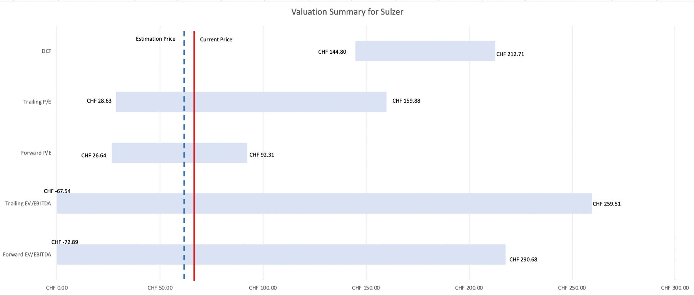

# AdvancedValuation

Advanced Valuation seminer, lectured by Nyborg Kjell G., Prof. Dr., from University of Zurich. The main learning content includes various valuation methods and case practice, which include:

- How to make a stand-alone valuation for a company in M&A deal.
- How to value a firm in LBO deal.
- How to make a paired recommendation for two trading companies in the same indusrty.

<figure>

<figcaption> Fig.1 Foot ball chart </figcaption>
</figure>

苏黎世大学Advanced Valuation研讨课，课程主要内容是关于各种估值方法的教授和实践，前欧洲金融学会主席Nyborg Kjell G., Prof. Dr.授课
